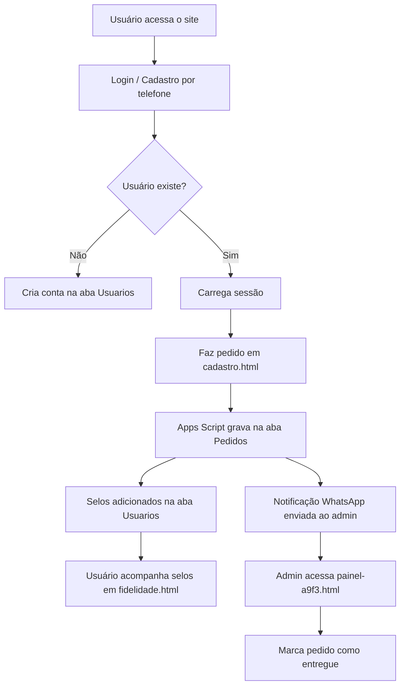

# 🍫 Browní — Sistema de Pedidos de Brownies Artesanais

<div align="center">

### Plataforma completa de pedidos online para brownies gourmet artesanais, com sistema de fidelidade e painel administrativo.


</div>

---

## 📖 Sobre o Projeto

O **Browní** é uma aplicação web voltada para um negócio de brownies artesanais, onde clientes podem realizar pedidos online, acompanhar seus pedidos e acumular selos em um programa de fidelidade — tudo sem precisar de um servidor ou banco de dados convencional.

O backend é inteiramente sustentado pelo **Google Sheets + Google Apps Script**, que funciona como banco de dados e API REST ao mesmo tempo. A comunicação entre o frontend e a planilha acontece via requisições HTTP GET para a URL publicada do Apps Script.

---

## ✨ Funcionalidades

- **Página inicial** com banner, apresentação e chamada para ação
- **Cadastro e login** de usuários via número de telefone
- **Fazer pedido** com nome, telefone, Instagram, quantidade e data de retirada
- **Alterar ou excluir** pedido pendente
- **Histórico de pedidos** por usuário (`meus-pedidos`)
- **Programa de fidelidade** com sistema de selos (a cada 12 brownies comprados, 1 gratuito)
- **Painel administrativo** (acesso por senha) para listar todos os pedidos e marcar como entregue
- **Notificação automática por WhatsApp** ao admin via CallMeBot a cada novo pedido
- **Sessão de usuário** gerenciada via `sessionStorage`
- **Cache local** de pedidos via `localStorage` para pré-preenchimento de formulário

---

## 🗂️ Estrutura do Projeto

```
browni/
│
├── index.html            # Página inicial (landing page)
├── login.html            # Tela de login / criação de conta
├── cadastro.html         # Formulário de pedido
├── meus-pedidos.html     # Histórico de pedidos do usuário
├── fidelidade.html       # Programa de fidelidade / selos
├── painel-a9f3.html      # Painel administrativo (rota oculta)
│
├── script.js             # Lógica principal de pedidos
├── auth.js               # Gerenciamento de sessão e chamadas à API
├── meus-pedidos.js       # Lógica da tela de histórico
├── fidelidade.js         # Lógica do programa de fidelidade
│
├── style.css             # Estilo global da aplicação
│
├── img/
│   ├── banner.png
│   ├── banner2.png
│   ├── avatar1.png
│   ├── avatar2.png
│   ├── avatar3.png
│   ├── avatar4.png
│   └── salary.png
│
└── appsscript.js         # Código do Google Apps Script (backend/API)
```

---

## 🛠️ Tecnologias Utilizadas

| Tecnologia | Função |
|---|---|
| HTML5 | Estrutura das páginas |
| CSS3 | Estilização e responsividade |
| JavaScript (Vanilla) | Lógica do frontend e consumo da API |
| Google Sheets | Banco de dados (abas `Pedidos` e `Usuarios`) |
| Google Apps Script | Backend como API REST (via `doGet`) |
| CallMeBot API | Notificações WhatsApp para o admin |
| sessionStorage | Gerenciamento de sessão do usuário |
| localStorage | Cache local de pedido para pré-preenchimento |

---

## 🗄️ Banco de Dados (Google Sheets)

O Google Sheets substitui um banco de dados convencional com duas abas:

### Aba `Pedidos`

| A | B | C | D | E | F | G | H |
|---|---|---|---|---|---|---|---|
| Nome | Telefone | Instagram | Quantidade | Data | Ação | Status | Total |

### Aba `Usuarios`

| A | B | C | D | E |
|---|---|---|---|---|
| Nome | Telefone | DataCadastro | Selos | BrowniesGanhos |

> A célula `I1` da aba Pedidos armazena o total de brownies com status `pendente` (ex: `TOTAL PENDENTE: 7`), fora dos dados tabulares.

---

## 🔌 API (Google Apps Script)

O backend é uma Web App publicada via Google Apps Script que responde a requisições `GET` com parâmetro `acao`.

### Rotas disponíveis

#### Pedidos

| Ação | Parâmetros | Descrição |
|---|---|---|
| `novo` | `nome`, `telefone`, `instagram`, `quantidade`, `data` | Cria um novo pedido |
| `consultar` | `telefone` | Verifica se existe pedido pendente |
| `alterar` | `telefone`, `nome`, `instagram`, `quantidade`, `data` | Atualiza pedido pendente |
| `excluir` | `telefone` | Remove pedido pendente |
| `meusPedidos` | `telefone` | Lista todos os pedidos do telefone |

#### Usuários

| Ação | Parâmetros | Descrição |
|---|---|---|
| `login` | `telefone` | Autentica usuário existente |
| `cadastrarUsuario` | `nome`, `telefone` | Cadastra novo usuário |
| `atualizarUsuario` | `nome`, `telefone` | Atualiza nome do usuário |
| `consultarSelos` | `telefone` | Retorna selos e brownies ganhos |

#### Admin (requer `senha`)

| Ação | Parâmetros | Descrição |
|---|---|---|
| `loginAdmin` | `senha` | Valida senha do painel admin |
| `listarPedidosAdmin` | `senha` | Lista todos os pedidos |
| `marcarEntregue` | `telefone`, `senha` | Marca pedido como entregue |

#### Exemplo de requisição

```
GET https://script.google.com/macros/s/{ID}/exec?acao=novo&nome=João&telefone=5519999999999&quantidade=2&data=01/06/2025
```

#### Exemplo de retorno

```json
{ "ok": true }
```

---

## 🎖️ Sistema de Fidelidade

- A cada brownie comprado, o usuário acumula **1 selo**
- Ao atingir **12 selos**, ganha **1 brownie grátis** e o contador zera
- Os selos são ajustados automaticamente ao alterar ou excluir pedidos
- Dados armazenados nas colunas `Selos` e `BrowniesGanhos` da aba `Usuarios`

---

## 🔔 Notificação WhatsApp

A cada novo pedido, o admin recebe uma mensagem automática no WhatsApp via [CallMeBot](https://www.callmebot.com/):

```
🍫 *Novo pedido Browní!*
👤 João Silva
📱 5519999999999
📸 @joaosilva
🔢 2 brownies
💰 R$ 14,00
📅 01/06/2025
```

### Como configurar

1. Adicione o número `+34 644 60 16 21` nos contatos do WhatsApp
2. Envie a mensagem: `I allow callmebot to send me messages`
3. Aguarde a API Key de resposta
4. No `appsscript.js`, preencha:

```javascript
var ADMIN_WHATSAPP_NUM = 'SEU_NUMERO_COM_DDI'; // Ex: 5519999998888
var CALLMEBOT_API_KEY  = 'SUA_API_KEY';
```

---

## ⚙️ Como Configurar e Implantar

### 1. Criar a Planilha no Google Sheets

1. Acesse [sheets.google.com](https://sheets.google.com) e crie uma nova planilha
2. Renomeie a primeira aba para `Pedidos`
3. A aba `Usuarios` é criada automaticamente pelo script

### 2. Configurar o Apps Script

1. Na planilha, vá em **Extensões → Apps Script**
2. Apague o código existente e cole o conteúdo de `appsscript.js`
3. Preencha as configurações no topo do arquivo:

```javascript
var ADMIN_WHATSAPP_NUM = 'SEU_NUMERO';   // com DDI, sem + ou espaços
var CALLMEBOT_API_KEY  = 'SUA_API_KEY';
var ADMIN_SENHA        = 'SUA_SENHA';    // senha do painel admin
```

4. Clique em **Implantar → Nova implantação**
5. Tipo: **Aplicativo da Web**
6. Executar como: **Eu mesmo**
7. Quem tem acesso: **Qualquer pessoa**
8. Copie a URL gerada

### 3. Configurar o Frontend

No arquivo `script.js`, cole a URL copiada:

```javascript
const GOOGLE_SCRIPT_URL = 'https://script.google.com/macros/s/SEU_ID/exec';
```

> O mesmo `GOOGLE_SCRIPT_URL` é referenciado em `auth.js`, `meus-pedidos.js` e `fidelidade.js`.

### 4. Hospedar o Frontend

O projeto é 100% estático — basta hospedar os arquivos em qualquer serviço:

- [GitHub Pages](https://pages.github.com/)
- [Netlify](https://netlify.com)
- [Vercel](https://vercel.com)

---

## 🔐 Painel Administrativo

O painel admin fica em `/painel-a9f3.html` (rota semi-oculta). Para acessar:

1. Abra a URL da página no navegador
2. Insira a senha configurada em `ADMIN_SENHA` no Apps Script
3. Visualize todos os pedidos e marque como entregue

> ⚠️ A senha é validada diretamente pelo Apps Script — o painel não funciona sem ela.

---

## 🌐 Fluxo da Aplicação



---

## 👥 Autores

Desenvolvido como projeto para um negócio real de brownies artesanais.

---

## 📄 Licença

Este projeto está sob a licença MIT. Sinta-se livre para usar, modificar e distribuir.